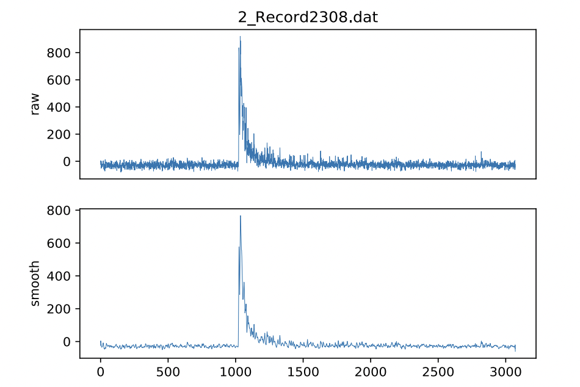

# Signal Processing Challenge

This is a coding challenge with simple requirements revolving around signal processing.

# High-level Requirements:

For each data file:
- Read in the data from the file
- Apply a pre-processing function
- Perform analysis on the pre-processed data
- Generate a PNG graphing the raw and pre-processed data
- Generate a JSON report of the analysis performed

# Low-level Requirements

## Reading the data

All data is located in within the `data/*.dat` files.

Each `.dat` file is a time-series of voltage readings. The file is line-delimited.

## Pre-processing the data

Smooth the data. 

To each frame, apply a sliding-window weighted-average algorithm:

    (tᵢ₋₃ + 2tᵢ₋₂ + 3tᵢ₋₁ + 3tᵢ + 3tᵢ₊₁ + 2tᵢ₊₂ + tᵢ₊₃) // 15

## Analyzing the data

Our analysis will consist of detecting all voltage spikes in each pre-processed dataset.

## Detecting spikes

A spike is when the voltage suddenly increases until it starts to decrease again. 

It has a start time and an end time.

### Spike start frame

A spike occurs when:
- all prior spikes have ended
- the increase in voltage, over a given period of time, passes a threshold.

Specifically a spike is detected at `tᵢ` when:

    θ = 100
    tᵢ₊₂ - tᵢ > θ

### Spike end frame

A voltage spike may persist over N frames.

The end of the spike is:

    the 50th frame after the first

    or

    the frame where: `tᵢ > tᵢ₊₁` (aka, the voltage drops)

No spike can be more than 50 frames long.

### Spike area

The area of a spike is the sum of the voltages of the frames that make it up.

# Reporting

## Graphing the data

Use matplot lib to produce graphs like so:

Here are the docs for `matplotnode` which has been provided as a dependency:

https://www.npmjs.com/package/matplotnode

## Writing the spike data

For each data file, create a JSON file with the following information:
- `source`, the filename of the raw data
- `graph`, the filename of the graphed data
- `spikes`, a list of objects describing each spike

For each spike, provide the following information:
- `start`, the spike's start frame
- `end`, the spike's end frame
- `max`, the highest voltage in the spike
- `min`, the lowest voltage in the spike
- `avg`, the spike's voltage average
- `area`, the sum of the spike's voltages

# Final Remarks

You have been given a specific set of requirements and no doubt you will produce a working solution.

Keep in mind, however, it is the architecture which will be under review.

Any requirement could change in the future! 

- Where the data comes from, where it goes. 
- The format of the input data. 
- The format of the output data. 
- The details of the smoothing formula
- The data pre-processing strategy could be changed away from smoothing entirely.
- Additional pre-processing steps could be introduced.
- The thresholds for spikes 
- The window for spike-start detection
- The method of spike-end detection
- The maximum size of a spike
- We might want to introduce additional forms of analysis
- The reporting requirements

And so on.

